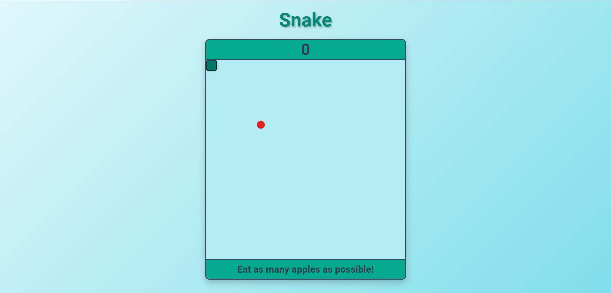
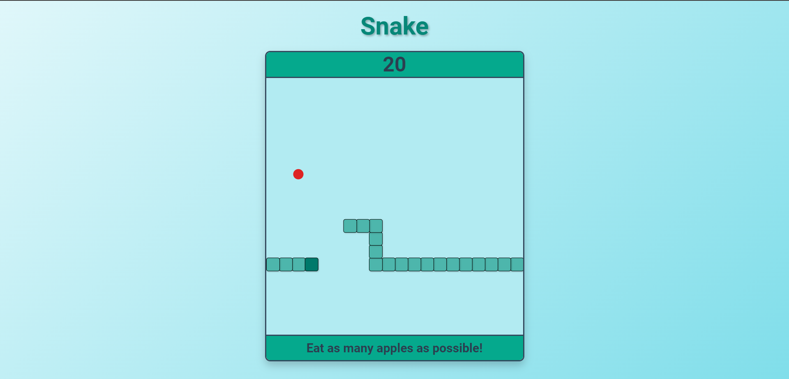
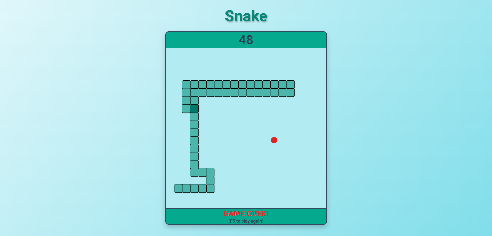

# Simple Snake game


A simple Snake game implemented using HTML, CSS, and JavaScript.

## Table of Contents
- [About](#about)
- [Features](#features)
- [Installation](#installation)
- [Usage](#usage)
- [Controls](#controls)
- [Screenshots](#screenshots)

## About
This is a classic Snake game where you control a snake to eat apples and grow longer. The game ends when the snake collides with itself.

## Features
- Simple and intuitive controls
- Score tracking
- Infinite map looping
- Growing snake with each apple eaten

## Installation
Clone the repository to your local machine:
```bash
git clone https://github.com/"your_username"/simple-snake-game.git
```

Open index.html in your browser to play the game.

## Usage
Once the game is loaded, use the arrow keys to move the snake. The goal is to eat as many apples as possible without running into yourself.

## Controls
Arrow keys:
- **Up Arrow (↑)**: Move the snake up.
- **Down Arrow (↓)**: Move the snake down.
- **Left Arrow (←)**: Move the snake left.
- **Right Arrow (→)**: Move the snake right.

## Screenshots



